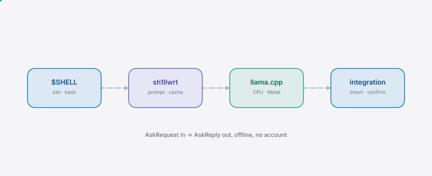

<div align="right"><sub><b>English</b>&nbsp;&nbsp;⇄&nbsp;&nbsp;<a href="./README.zh-CN.md">中文</a></sub></div>

<picture>
  <source media="(prefers-color-scheme: dark)" srcset="./assets/hero-dark.svg">
  <source media="(prefers-color-scheme: light)" srcset="./assets/hero-light.svg">
  
</picture>

<p align="center"><sub>sh1llwrt is the offline local model that writes the shell command you meant, no account.</sub></p>

<p align="center">
  <a href="./LICENSE"></a>
  <a href="https://github.com/SuperMarioYL/sh1llwrt/releases"></a>
  <a href="https://github.com/SuperMarioYL/sh1llwrt/actions/workflows/ci.yml"></a>
  
</p>

**The shell-flag-google cycle, ended.** Type what you want, get the command in under a second — offline, zero account, zero config.

<h2> Architecture</h2>

<picture>
  <source media="(prefers-color-scheme: dark)" srcset="./assets/atlas-dark.svg">
  <source media="(prefers-color-scheme: light)" srcset="./assets/atlas-light.svg">
  
</picture>

One process, one binary, no daemon, no server, no sockets. A typed sentence becomes an `AskRequest` (shell, cwd, named files, history); the prompt template turns it into a shell-scoped few-shot prompt; the cached GGUF runs through llama.cpp; the parseable `AskReply` (command, safe, explain) lands back in your `$SHELL`. The first run downloads the 941MB Qwen2.5-Coder-1.5B Q4_K_M GGUF once and verifies its sha256; every run after is fully offline, account-free, sub-second.

<h2> Why this exists</h2>

The path from intent to a correct, file-adapted shell command is four manual steps and a browser tab when it should be zero. Every week you re-google `tar` / `ffmpeg` / `magick` / `sed` / `kubectl` / `rsync` flags, lose your terminal context to a browser detour, and paste back something that doesn't know your real `cwd` or filenames. sh1llwrt collapses that to one typed sentence inside `$SHELL` — offline, sub-second, no account. The pain isn't "shell commands are hard"; it's that the intent-to-command round-trip should never leave the terminal.

> **Honest quality floor.** The OP-class model scores 0.620 on InterCode-ALFA (GPT-4o = 0.73). The shell-scoped prompt is the real lift, not the weights. If a hand-curated 20-task dev benchmark scores below 0.70, v0.1 ships no further — see the kill criteria in the roadmap.

<details>
<summary>Table of contents</summary>

- [Architecture](#-architecture)
- [Why this exists](#-why-this-exists)
- [Quickstart](#-quickstart)
- [Usage](#-usage)
- [Demo](#-demo)
- [Configuration](#-configuration)
- [Roadmap](#-roadmap)
- [License](#-license)
</details>

<h2> Quickstart</h2>

From a cold clone to a first command in three commands:

```bash
git clone https://github.com/SuperMarioYL/sh1llwrt && cd sh1llwrt
go install ./cmd/sh1llwrt          # builds the binary into $GOPATH/bin
sh1llwrt init && exec $SHELL       # wires the ?-prefix; restart your shell
```

Then ask (first run downloads the 941MB model once, then it's offline forever):

```bash
? extract foo.tar.gz to /tmp
# → tar -xzf foo.tar.gz -C /tmp
```

Prefer `curl|sh`? (once the first release is tagged):

```bash
curl -fsSL https://raw.githubusercontent.com/SuperMarioYL/sh1llwrt/main/scripts/install.sh | sh
```

<details>
<summary>sample output</summary>

```
$ ? resize cat.png to 200x200
# resize image to 200x200 box
magick cat.png -resize 200x200 cat_small.png
# destructive — review before pressing Enter
```
</details>

> **No model downloaded yet?** `sh1llwrt ask --mock "<intent>"` runs the full prompt→parse→print flow on a deterministic mock backend, no GGUF required. It exists for the test suite, the demo gif, and trying the UX without the one-time download.

<h2> Usage</h2>

```bash
# the core verb — turn a sentence into a command
sh1llwrt ask "convert clip.mov to mp4 h264"
# → ffmpeg -i clip.mov -c:v libx264 -c:a aac clip.mp4

# inject your real cwd + named files as context
sh1llwrt ask --cwd "$PWD" --glob img.png,img.tiff "resize the png to half"

# wire the ?-prefix into zsh/bash (idempotent — re-running replaces the block)
sh1llwrt init

# machine-readable output for scripts / wrappers
sh1llwrt ask --json "list kube-system pods"
# → {"command":"kubectl get pods -n kube-system","safe":true,"explain":"read-only pod listing"}
```

Key flags: `--shell zsh|bash`, `--cwd`, `--glob` (repeatable), `--threads`, `--max-tokens`, `--temperature`, `--mock`, `--json`, `--insert` (m2, fails closed in m1), `--verbose`. See `sh1llwrt ask --help`. More in [`examples/`](./examples).

<h2> Demo</h2>

The gif below runs the real binary in `--mock` mode so it renders without the one-time 941MB download; a real first run is identical except for the single download step.


The tape that produced it lives at [`docs/demo.tape`](./docs/demo.tape) and re-renders on demand via the `demo` workflow.

<h2> Configuration</h2>

sh1llwrt has no config file — all knobs are environment variables. v0.1 is zero-config by default.

| Env | Default | Meaning |
|---|---|---|
| `SH1LLWRT_CACHE_DIR` | `$XDG_CACHE_HOME/sh1llwrt` | GGUF cache root (override for airgapped deploys) |
| `SH1LLWRT_MODEL_URL` | HuggingFace canonical | Override the one-time download URL |
| `SH1LLWRT_MODEL_SHA256` | *(unset)* | Expected sha256; unset = trust an existing file (pre-release) |
| `SH1LLWRT_LLAMA_CLI` | `llama-cli` in PATH | Path to the llama.cpp CLI binary |
| `SH1LLWRT_MOCK` | *(unset)* | `1` = use the deterministic mock backend (no model needed) |

> Before tagging `v0.1.0`, set `DefaultModelSHA256` in `internal/model/cache.go` to the measured digest of the canonical GGUF (or pass `SH1LLWRT_MODEL_SHA256`). Until then sha verification is skipped with a warning so the binary is runnable end-to-end.

<h2> Roadmap</h2>

- [x] **m1_boot_model** — `sh1llwrt ask` returns the command via llama.cpp in <1s on a warm cache; first run auto-downloads + sha256-verifies the GGUF to `$XDG_CACHE_HOME/sh1llwrt/`.
- [ ] **m2_shell_meet** — `sh1llwrt init` wires a `?`-prefix + Ctrl-Space hotkey into zsh/bash so one sentence becomes an insertable command at the cursor, with Safe-confirm on destructive verbs.
- [ ] **m3_ship_binary** — static CGO binary for darwin/arm64 + linux/amd64; `curl|sh` installer; README + 60s demo gif.
- [ ] **future** — hand-curated 20-task dev benchmark (kill gate: <0.70 stops the line); oh-my-zsh plugin; kubectl/git/docker flag expansion; Windows.

**Kill criteria (from the plan):** ship no further if, 21 days post-launch, GitHub stars <100 AND fewer than 3 organic issues AND warm-cache p95 >1.2s on an i5-class/4-thread laptop — or if the hand-curated 20-task dev benchmark scores below 0.70 correct.

<h2> License</h2>

MIT — see [LICENSE](./LICENSE). File issues and PRs against the [GitHub repo](https://github.com/SuperMarioYL/sh1llwrt/issues). v0.1 is OSS-only, free, no hosted tier, no paywalled feature.

<p align="center"><sub><a href="./LICENSE">MIT</a> © 2026 SuperMarioYL</sub></p>
