[English](./README.md) · [Website](https://sh1llwrt.lei6393.com) · [GitHub](https://github.com/SuperMarioYL/sh1llwrt)

<picture>
  <source media="(max-width: 600px) and (prefers-color-scheme: dark)" srcset="./assets/presentation/hero-mobile-dark.svg">
  <source media="(max-width: 600px)" srcset="./assets/presentation/hero-mobile-light.svg">
  <source media="(prefers-color-scheme: dark)" srcset="./assets/presentation/hero-dark.svg">
  
</picture>

# sh1llwrt

**先读建议的 Shell 命令，再决定执行。**

sh1llwrt 将请求与 Shell、工作目录、文件名上下文组合，向本地模型请求结构化响应，再输出建议命令及解释。

## 为什么需要它

命令建议了解当前 Shell 与文件名时更有用。把这些上下文放入 prompt，再返回可在终端检查的命令。

- **包含 Shell 上下文** — 请求携带 shell、cwd 与文件名。
- **检查结构化输出** — JSON 保留命令与解释。
- **离线体验接口** — mock 无需配置模型即可运行解析链路。

## 架构

<picture>
  <source media="(max-width: 600px) and (prefers-color-scheme: dark)" srcset="./assets/presentation/architecture-mobile-dark.svg">
  <source media="(max-width: 600px)" srcset="./assets/presentation/architecture-mobile-light.svg">
  <source media="(prefers-color-scheme: dark)" srcset="./assets/presentation/architecture-dark.svg">
  
</picture>

BuildPrompt 构建 Shell 请求；模型缓存为 CLIRunner 准备 GGUF，后者调用外部 llama-cli 进程。ParseReply 提取 command、safe、explain，Print 或 JSON 集成器展示结果；--mock 通过同一解析器处理确定性响应。

| 组件 | 职责 |
| --- | --- |
| `Request context` | internal/prompt/template.go |
| `GGUF cache` | internal/model/cache.go |
| `CLI or mock runner` | internal/llama/runner.go |
| `Reviewable output` | internal/shell/integration.go |

## 安装与快速上手

使用仓库清单声明的运行时版本。以下源码安装步骤可复现随仓示例。

```bash
git clone https://github.com/SuperMarioYL/sh1llwrt.git
cd sh1llwrt
go build ./cmd/sh1llwrt
```

需要 Go 1.24+ 与 Python 3；两个完整 mock 请求生成结构化建议，不执行建议命令。

```bash
python3 examples/presentation_demo.py
```

## 实际运行示例

<picture>
  <source media="(max-width: 600px) and (prefers-color-scheme: dark)" srcset="./assets/presentation/process-mobile-dark.svg">
  <source media="(max-width: 600px)" srcset="./assets/presentation/process-mobile-light.svg">
  <source media="(prefers-color-scheme: dark)" srcset="./assets/presentation/process-dark.svg">
  
</picture>

The fixture returns a tar extraction proposal marked false and a pod-listing proposal marked true; neither command runs.

```text
{"command":"tar -xzf foo.tar.gz -C /tmp","safe":false,"explain":"extract gzipped tarball into /tmp"}
{"command":"kubectl get pods -n kube-system","safe":true,"explain":"read-only pod listing"}
```

完整命令与输出保存在 [docs/demo-results.json](./docs/demo-results.json). 输入和复现代码均随仓提供。


保留已有录制供参考；上方文字示例给出当前可复现的操作。

## 用法

安装后在仓库根目录运行以下命令；处理自己的数据时替换相应路径。

```bash
go run ./cmd/sh1llwrt ask --mock --json "list kube-system pods"
# With llama-cli and the model available:
go run ./cmd/sh1llwrt ask --shell bash --cwd "$PWD" --glob clip.mov "convert clip.mov to mp4 h264"
```

## 配置

SH1LLWRT_CACHE_DIR 选择 GGUF 缓存；SH1LLWRT_MODEL_URL 与 SH1LLWRT_MODEL_SHA256 指定来源和期望摘要；SH1LLWRT_LLAMA_CLI 指定可执行文件。--threads、--max-tokens（默认 96）与 --temperature 控制生成。--glob 提供文件名，不任意读取文件内容。init 会写 Shell 集成；快速上手示例不修改 Shell 配置。

## 集成与职责分工

<picture>
  <source media="(max-width: 600px) and (prefers-color-scheme: dark)" srcset="./assets/presentation/integrations-mobile-dark.svg">
  <source media="(max-width: 600px)" srcset="./assets/presentation/integrations-mobile-light.svg">
  <source media="(prefers-color-scheme: dark)" srcset="./assets/presentation/integrations-dark.svg">
  
</picture>

根据工作流选择输入与输出路径。本文本地示例验证其中明确说明的子流程。

| 路径 | 已实现职责 |
| --- | --- |
| Bash / Zsh context | Prompt grammar selection |
| GGUF file | Local model cache |
| llama-cli | External inference executable |
| Text / JSON | Command proposals |
| Mock backend | No-model examples |

## 限制与后续方向

- 记录的建议来自关键词 mock 响应，不衡量模型质量、热缓存延迟或硬件性能。
- safe 字段是响应提供的分类，不是独立安全检查。CLI 只打印建议，不执行；--insert 尚未实现。
- 真实推理需要单独安装 llama.cpp CLI 和 GGUF。内置期望 SHA256 为空，须配置 SH1LLWRT_MODEL_SHA256 才会进行摘要核验。

光标位置内联插入、打包推理运行时与有代表性的命令质量基准仍是后续方向。

## 许可与贡献

许可见 [LICENSE](./LICENSE). 反馈问题时请提供最小输入、执行命令和实际输出。
